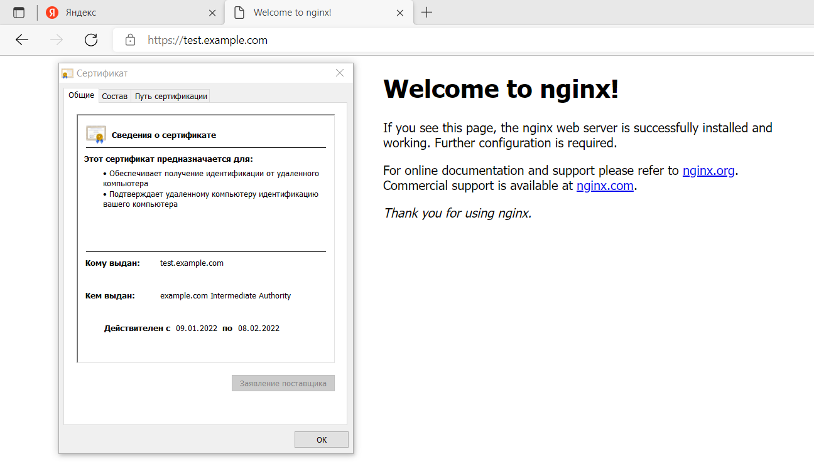
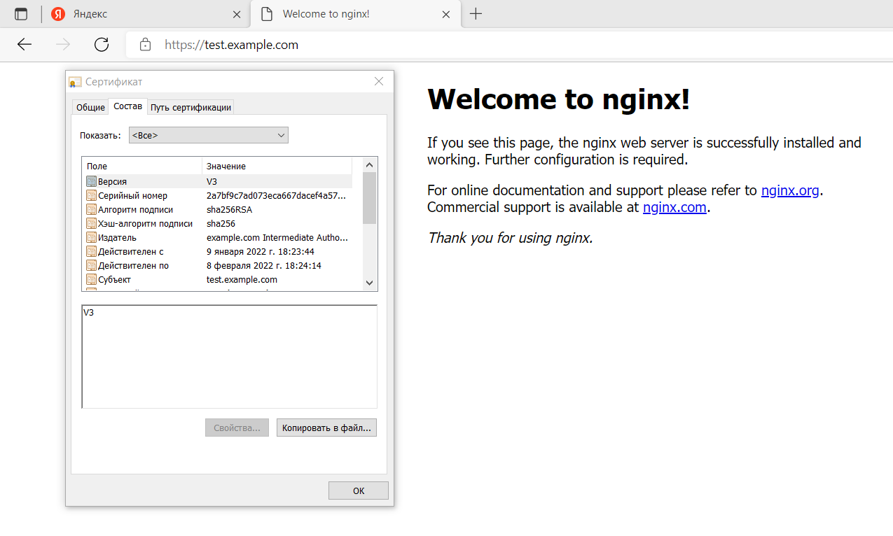
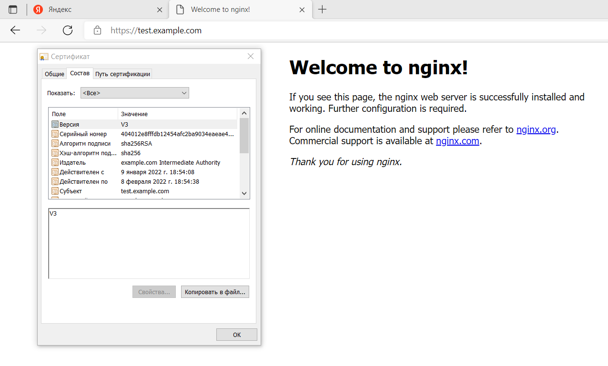

# Курсовая работа по итогам модуля "DevOps и системное администрирование"

1. Создайте виртуальную машину Linux.
```
 # Vagrantfile
 Vagrant.configure("2") do |config|
 	      config.vm.box = "ubuntu/bionic64"
        config.vm.network "public_network"
        config.vm.network "forwarded_port", guest:22, host:22
        config.vm.network "forwarded_port", guest:443, host:443
 end
```

2. Установите ufw и разрешите к этой машине сессии на порты 22 и 443, при этом трафик на интерфейсе localhost (lo) должен ходить свободно на все порты.
```
$ sudo apt install ufw 
$ sudo ufw allow ssh
$ sudo ufw allow https
$ sudo ufw enable
Command may disrupt existing ssh connections. Proceed with operation (y|n)? y
Firewall is active and enabled on system startup
$ sudo ufw status verbose
Status: active
Logging: on (low)
Default: deny (incoming), allow (outgoing), disabled (routed)
New profiles: skip

To                         Action      From
--                         ------      ----
22/tcp                     ALLOW IN    Anywhere
443/tcp                    ALLOW IN    Anywhere
22/tcp (v6)                ALLOW IN    Anywhere (v6)
443/tcp (v6)               ALLOW IN    Anywhere (v6)
```

3. Установите hashicorp vault (инструкция по ссылке https://learn.hashicorp.com/tutorials/vault/getting-started-install?in=vault/getting-started#install-vault).
```
$ curl -fsSL https://apt.releases.hashicorp.com/gpg | sudo apt-key add -
$ sudo apt-add-repository "deb [arch=amd64] https://apt.releases.hashicorp.com $(lsb_release -cs) main"
$ sudo apt-get update && sudo apt-get install vault
writing new private key to 'tls.key'
-----
Vault TLS key and self-signed certificate have been generated in '/opt/vault/tls'.
```

4. Cоздайте центр сертификации по инструкции (ссылка) и выпустите сертификат для использования его в настройке веб-сервера nginx (срок жизни сертификата - месяц).
```
В отдельном терминале запустил:
$ vault server -dev -dev-root-token-id root

В другом терминале:
$ export VAULT_ADDR=http://127.0.0.1:8200
$ export VAULT_TOKEN=root
$ vault secrets enable pki
Success! Enabled the pki secrets engine at: pki/
$ vault secrets tune -max-lease-ttl=87600h pki
Success! Tuned the secrets engine at: pki/
$ vault write -field=certificate pki/root/generate/internal \
     common_name="example.com" \
     ttl=87600h > CA_cert.crt
$ vault write pki/config/urls \
      issuing_certificates="$VAULT_ADDR/v1/pki/ca" \
      crl_distribution_points="$VAULT_ADDR/v1/pki/crl"
Success! Data written to: pki/config/urls
$ vault secrets enable -path=pki_int pki
Success! Enabled the pki secrets engine at: pki_int/
$ vault secrets tune -max-lease-ttl=43800h pki_int
Success! Tuned the secrets engine at: pki_int/
$ sudo apt install jq
$ vault write -format=json pki_int/intermediate/generate/internal \
     common_name="example.com Intermediate Authority" \
     | jq -r '.data.csr' > pki_intermediate.csr
$ vault write -format=json pki/root/sign-intermediate csr=@pki_intermediate.csr \
     format=pem_bundle ttl="43800h" \
     | jq -r '.data.certificate' > intermediate.cert.pem
$ vault write pki_int/intermediate/set-signed certificate=@intermediate.cert.pem
Success! Data written to: pki_int/intermediate/set-signed
$ vault write pki_int/roles/example-dot-com allowed_domains="example.com" allow_subdomains=true max_ttl="720h"
Success! Data written to: pki_int/roles/example-dot-com
~$ vault write pki_int/issue/example-dot-com common_name="test.example.com" ttl="720h"

```

5. Установите корневой сертификат созданного центра сертификации в доверенные в хостовой системе.
```
$ ls
CA_cert.crt  intermediate.cert.pem  pki_intermediate.csr
vagrant@ubuntu-bionic:~$ nano CA_cert.crt
-----BEGIN CERTIFICATE-----
MIIDNTCCAh2gAwIBAgIUVddt7auXi317xfC2Nk5OVaOJVwEwDQYJKoZIhvcNAQEL
BQAwFjEUMBIGA1UEAxMLZXhhbXBsZS5jb20wHhcNMjIwMTAzMDM1NTE3WhcNMzIw
MTAxMDM1NTQ3WjAWMRQwEgYDVQQDEwtleGFtcGxlLmNvbTCCASIwDQYJKoZIhvcN
AQEBBQADggEPADCCAQoCggEBAOmQpRIWK228LYQoe6gI0A9ULPJQqGBajs2a1kas
tJvu/w+oVw9VuWM4xWJydaW+0WccyL/BxVBonfrNgP78LoWqoLl1p/Qh3IC85SRn
78AdpC1tQfZ95frOpCM1nkRup6LlDTOS7CUx0Lqc8RC0GvjmQNj5QegIGEzsOBQ7
qqMrgGSnNNlDOOxL2BknIa6WtOZpUoFuba62pEQKsyGSHUAJjf3QEmlUXfFLwwEs
B9UbYxqFIxyRkqVkg2EJn+EBzhQeTR0HziJ9T8MSPeu0GalTSPEmH2+Fh4oFS08v
dOVLywANECjHyJYJlzDWERys2kgCZW68ZRpVSar5mzCJ+ucCAwEAAaN7MHkwDgYD
VR0PAQH/BAQDAgEGMA8GA1UdEwEB/wQFMAMBAf8wHQYDVR0OBBYEFL2dq7yu4GWm
4I37kqUEdb/xI8TwMB8GA1UdIwQYMBaAFL2dq7yu4GWm4I37kqUEdb/xI8TwMBYG
A1UdEQQPMA2CC2V4YW1wbGUuY29tMA0GCSqGSIb3DQEBCwUAA4IBAQBOrNSMjZay
Jm8PZdrVrFL9ftd9L6dvPqH6Kipn596Ms179OP4qEPg23BjLZjYKoasE1TJsn4Ie
ppegrQwDGJwWGFnV+glTghaaq3xKfZgnkj7xnrWSN9AfMoWQG+4AMnmOTg79oQvC
qPz6unBY1asBzSIYQ1bOehIuBpGWozPD4do4Y2j3s+ldbfgElVjqrdzKfiAvWAbB
qyOksGdDCt0AFopPRjS8N/2xbjun3OodVxjDGGsfWmtn0MxWmJcYr6A3o9yLN44H
SU6Pd8+MANY82LSO/uCsG5B1KNwZIv9jVeL+mx7u2qyCZvQahVl59LUdZujmxPA7
edHC5LEF0K3a
-----END CERTIFICATE-----

Сохранил на Windows-машине в текстовый файл и добавил (импортом) в Доверенные центры сертификации
https://prnt.sc/25s0rcc
```

6. Установите nginx.
```
$ sudo apt-add-repository ppa:nginx/stable
$ sudo apt update
$ sudo apt install nginx
```

7. По инструкции (ссылка) настройте nginx на https, используя ранее подготовленный сертификат:
можно использовать стандартную стартовую страницу nginx для демонстрации работы сервера;
можно использовать и другой html файл, сделанный вами;
```
$ sudo nano /etc/nginx/conf.d/test-example-com.conf
server {
    listen 443 ssl;
    server_name         test.example.com;
    ssl_certificate     /opt/vault/tls/tls.crt;
    ssl_certificate_key /opt/vault/tls/tls.key;
    ssl_protocols       TLSv1 TLSv1.1 TLSv1.2;
    ssl_ciphers         HIGH:!aNULL:!MD5;
}
$ sudo systemctl restart nginx

На Windows-машине записал в system32/drivers/etc/hosts
127.0.0.1 test.example.com

Заработало:
https://prnt.sc/25siwul
```

8. Откройте в браузере на хосте https адрес страницы, которую обслуживает сервер nginx.
```
Создал свою страницу /var/www/html/page.html:

<!DOCTYPE html>
<html lang="en">
<head>
  <meta charset="utf-8">
  <title>My page</title>
</head>
<body>
        <h1>Hello world!</h1>
</body>
</html>

$ sudo nano /etc/nginx/conf.d/test-example-com.conf
server {
    listen 443 ssl;
    server_name         test.example.com;
    ssl_certificate     /opt/vault/tls/tls.crt;
    ssl_certificate_key /opt/vault/tls/tls.key;
    ssl_protocols       TLSv1 TLSv1.1 TLSv1.2;
    ssl_ciphers         HIGH:!aNULL:!MD5;
    location / {
       root /var/www/html;
       index page.html;
    }
}

Результат:
https://prnt.sc/25sjjsd

После установки вагранта с сетевым доступом типа мост (подключая карту как мост, тогда она получит IP адрес от роутера) 
и запуском скрипта из задания 9, обновившим цепочку сертификатов (в правильном формате) 
защищенное соединение стало работать с сертификатом

----- Vagrantfile -----
 Vagrant.configure("2") do |config|
       	config.vm.box = "ubuntu/bionic64"
        config.vm.network "public_network"
        config.vm.network "forwarded_port", guest:22, host:22
        config.vm.network "forwarded_port", guest:443, host:443
 end

$ ifconfig
enp0s3: flags=4163<UP,BROADCAST,RUNNING,MULTICAST>  mtu 1500
        inet 10.0.2.15  netmask 255.255.255.0  broadcast 10.0.2.255
        inet6 fe80::77:80ff:feca:b7e6  prefixlen 64  scopeid 0x20<link>
        ether 02:77:80:ca:b7:e6  txqueuelen 1000  (Ethernet)
        RX packets 1070  bytes 151377 (151.3 KB)
        RX errors 0  dropped 0  overruns 0  frame 0
        TX packets 763  bytes 137293 (137.2 KB)
        TX errors 0  dropped 0 overruns 0  carrier 0  collisions 0

enp0s8: flags=4163<UP,BROADCAST,RUNNING,MULTICAST>  mtu 1500
        inet 192.168.0.106  netmask 255.255.255.0  broadcast 192.168.0.255
        inet6 fe80::a00:27ff:fe19:16ed  prefixlen 64  scopeid 0x20<link>
        ether 08:00:27:19:16:ed  txqueuelen 1000  (Ethernet)
        RX packets 3  bytes 1240 (1.2 KB)
        RX errors 0  dropped 0  overruns 0  frame 0
        TX packets 10  bytes 1342 (1.3 KB)
        TX errors 0  dropped 0 overruns 0  carrier 0  collisions 0

lo: flags=73<UP,LOOPBACK,RUNNING>  mtu 65536
        inet 127.0.0.1  netmask 255.0.0.0
        inet6 ::1  prefixlen 128  scopeid 0x10<host>
        loop  txqueuelen 1000  (Local Loopback)
        RX packets 16  bytes 1628 (1.6 KB)
        RX errors 0  dropped 0  overruns 0  frame 0
        TX packets 16  bytes 1628 (1.6 KB)
        TX errors 0  dropped 0 overruns 0  carrier 0  collisions 0

В hosts прописал 192.168.0.106 test.example.com   
(127.0.0.1 - локальная петля LOOPBACK)
```
Скриншот валидного сертификата


9. Создайте скрипт, который будет генерировать новый сертификат в vault:
генерируем новый сертификат так, чтобы не переписывать конфиг nginx;
перезапускаем nginx для применения нового сертификата.

(материалы: https://itdraft.ru/2020/12/02/hashicorp-vault-kak-czentr-sertifikaczii-ca-vault-pki/  
Порядок работы скрипта:  
Генерируем новый сертификат и записываем его в формате json в файл vault.example.com.crt  
$ vault write -format=json pki_int/issue/example-dot-com common_name="test.example.com" ttl="720h" > vault.example.com.crt  
Сохраняем сертификаты в правильном формате  
$ cat vault.example.com.crt | jq -r .data.certificate > vault.example.com.crt.pem  
$ cat vault.example.com.crt | jq -r .data.issuing_ca >> vault.example.com.crt.pem  
$ cat vault.example.com.crt | jq -r .data.private_key > vault.example.com.crt.key  
Копируем новые сертификаты vault.example.com.crt.pem в /opt/vault/tls/tls.crt, а vault.example.com.crt.key в /opt/vault/tls/tls.key)  
```
$ sudo nano cert.sh
------------------
#!/usr/bin/env bash
export VAULT_ADDR=http://127.0.0.1:8200
export VAULT_TOKEN=root
vault write -format=json pki_int/issue/example-dot-com common_name="test.example.com" ttl="720h" > vault.example.com.crt
cat vault.example.com.crt | jq -r .data.certificate > vault.example.com.crt.pem
cat vault.example.com.crt | jq -r .data.issuing_ca >> vault.example.com.crt.pem
cat vault.example.com.crt | jq -r .data.private_key > vault.example.com.crt.key
sudo cp vault.example.com.crt.pem /opt/vault/tls/tls.crt
sudo cp vault.example.com.crt.key /opt/vault/tls/tls.key
sudo systemctl restart nginx
------------------
$ sudo chmod 755 cert.sh
$ ./cert.sh

Скриншот отработавшего скрипта (смотрю изменились ли файлы в папке /opt/vault/tls)
https://prnt.sc/267f3ci
```

10. Поместите скрипт в crontab, чтобы сертификат обновлялся какого-то числа каждого месяца в удобное для вас время.
```
$ crontab -e

10 2 10 * * /var/www/html/./cert.sh

Каждое 10-е число каждого месяца, в 2 часа 10 минут, будет запускаться генерация нового сертификата и перезапуск nginx, чтобы обновление вступило в силу
```
Перезапуск скрипта пересоздает сертификаты и страничка так же остается валидной

До перезапуска (старый сертификат)



После перезапуска скрипта (новый сертификат)



