# Дипломный практикум в YandexCloud

Репозиторий с исходными файлами проекта [https://github.com/vladmilev/diplom](https://github.com/vladmilev/diplom)   

## 1. Доменное имя
- зарегистрирован домен `milevsky.quest` через регистратора https://www.reg.ru/  
- в YandexCloud [зарезервирован статический публичный IP-адрес](https://cloud.yandex.ru/docs/vpc/operations/get-static-ip) - 62.84.118.248
- добавлены настройки для субдоменов (А-записи, указывают соответствие доменного имени и IPv4-адреса) у регистратора  
```
https://www.milevsky.quest (WordPress) www → 62.84.118.248
https://gitlab.milevsky.quest (Gitlab) gitlab → 62.84.118.248
https://grafana.milevsky.quest (Grafana) grafana → 62.84.118.248
https://prometheus.milevsky.quest (Prometheus) prometheus → 62.84.118.248
https://alertmanager.milevsky.quest (Alert Manager) alertmanager → 62.84.118.248
```
Личный кабинет https://www.reg.ru/user/account 
<p align="center">
  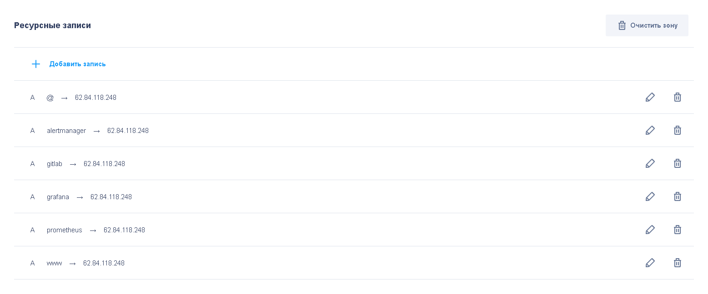
</p>

## 2. Облачная инфраструктура 
(развертывание инфраструктуры с помощью Terraform на базе облачного провайдера YandexCloud)

На виртуальной машине (may1) уже оказались установлены yc и terraform  
Настройку бакета (бекэнда) делал по [Загрузка состояний Terraform в Object Storage](https://cloud.yandex.ru/docs/tutorials/infrastructure-management/terraform-state-storage)  

предварительно - создал сервис-аккаунт:  
$ yc iam service-account create --name vlad-milev-account --description "favorite service account"  
id: aje1sgffja87k3fi62gj  
назначил созданному сервисному аккаунту (aje1sgffja87k3fi62gj) роль editor  
Создал статические ключи доступа:  
$ yc iam access-key create --service-account-name vlad-milev-account --description "this key is for my bucket"   
Через консоль console.cloud.yandex.ru создал бакет vlad-milev-bucket   
Можно писать и запускать код - предварительно, под диплом, создан новый репозиторий [https://github.com/vladmilev/diplom](https://github.com/vladmilev/diplom)   
$ git clone git@github.com:vladmilev/diplom.git

Настройки провайдера и бэкенда - [providers.tf](https://github.com/vladmilev/diplom/blob/main/terraform/providers.tf)  
Настройки сети и двух подсетей в разных зонах доступности - [network.tf](https://github.com/vladmilev/diplom/blob/main/terraform/network.tf)  
Инициализируем terrraform  
`$ terraform init`  
Создаем воркспейсы stage и prod:   
`$ terraform workspace new stage`  
`$ terraform workspace new prod`  
(долго выдавала ошибку доступа - надо вызвать ACL-бакета через три точки в списке бакетов консоли в браузере)  
указанные воркспейсы появились в бакете облака:  
<p align="center">
  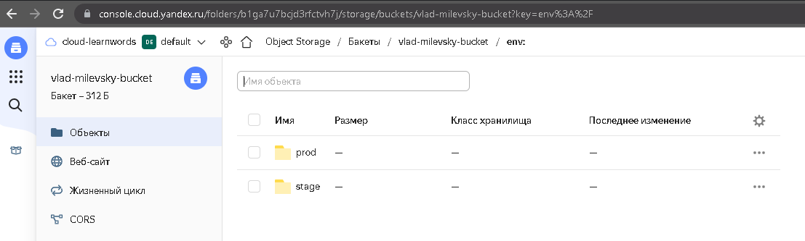
</p>
Запускаем инфраструктуру:  
`$ terraform apply`  
создает (на данном этапе) 1 сеть (network-1) с двумя подсетями (subnet-1, subnet-2)    
Удаляем по окончании работ указанные ресурсы из облака:  
`$ terraform destroy`  


## 3. Nginx и LetsEncrypt  
(Ansible роль для установки Nginx и LetsEncrypt)  
Необходимо создать reverse proxy с поддержкой TLS для обеспечения безопасного доступа к веб-сервисам по HTTPS.  

Reverse proxy (обратный прокси-сервер) — тип прокси-сервера, который ретранслирует запросы клиентов из внешней сети на один или несколько серверов, логически расположенных во внутренней сети. При этом для клиента это выглядит так, будто запрашиваемые ресурсы находятся непосредственно на прокси-сервере).  

Надо поднять одну виртуальную машину с сервером nginx (194.58.112.174 - адрес, доменное имя milevsky.quest) c характеристиками: 2vCPU, 2 RAM, External address (Public) и Internal address.   
Сервер с Nginx будет служить маршрутиразтором запросов к различным серверам внутренней сети - у нас есть только один сервер с public ip (194.58.112.174), а сертификаты LetsEncrypt нужны на серверах внутри сети для безопасного трафика.  

Поиск по запросу: Ansible Nginx и letsencrypt выдал первую [ссылку с решением](https://gist.github.com/mattiaslundberg/ba214a35060d3c8603e9b1ec8627d349)  

(1) В вашей доменной зоне настроены все A-записи на внешний адрес этого сервера:
Статья про Cloud DNS https://cloud.yandex.ru/docs/dns/quickstart  

В Virtual Private Cloud / IP-адреса - зарезервировал адрес в ru-central1-a (subnet-1)  62.84.118.248  
Этот адрес указал для настроек терраформа для сервера nginx - nat_ip_address = var.yc_public_ip ("62.84.118.248")  

В Cloud DNS создал публичную зону milevsky.quest.   
для нее настроил A-записи (A — сопоставление доменного имени и IPv4-адреса [ссылка](https://cloud.yandex.ru/docs/dns/concepts/resource-record?utm_source=console&utm_medium=side-bar-left&utm_campaign=dns) ) с указаем статического выделенного IPv4 адреса
```
alertmanager.milevsky.quest.	A	600	62.84.118.248
gitlab.milevsky.quest.	A	600	62.84.118.248
grafana.milevsky.quest.	A	600	62.84.118.248
milevsky.quest.	NS	3600	ns1.yandexcloud.net.ns2.yandexcloud.net.
milevsky.quest.	SOA	3600	ns1.yandexcloud.net. mx.cloud.yandex.net. 1 10800 900 604800 86400
prometheus.milevsky.quest.	A	600	62.84.118.248
www.milevsky.quest.	A	600	62.84.117.51
```

(2) Поднимем ВМ под сервер Nginx - с помощью Terraform (terraform apply) - файл [nginx.tf](https://github.com/vladmilev/diplom/blob/main/terraform/nginx.tf)
```
resource "yandex_compute_instance" "nginx" {
  name     = "nginx"
  hostname = "milevsky.quest"

  resources {
    cores  = 2
    memory = 2
  }

  boot_disk {
    initialize_params {
      image_id = "fd8ic5bmgr51h6e7bh1v"
    }
  }

  network_interface {
    subnet_id      = yandex_vpc_subnet.subnet-1.id
    nat            = true
    nat_ip_address = var.yc_public_ip
  }

  metadata = {
    ssh-keys  = "ubuntu:${file("~/.ssh/id_rsa.pub")}"
  }
}
```
variables.tf  
```
variable "yc_public_ip" {
  default = "62.84.118.248"
}
```

(3) указываем хост сервера в файле ansible/hosts  
```
[nginx]
milevsky.quest ansible_host=62.84.118.248 letsencrypt_email=vlad_milev@mail.ru domain_name=milevsky.quest
```

(4) формируем плейбук для выполнения ansible/nginx-server.yml
```
- hosts: nginx
  become: true
  become_method: sudo
  become_user: root
  remote_user: ubuntu
  gather_facts: true
  roles:
   - Nginx_LetsEncrypt
```   

(5) Формируем роль Nginx_LetsEncrypt  
список задач [ansible/roles/Nginx_LetsEncrypt/tasks/main.yml](https://github.com/vladmilev/diplom/blob/main/ansible/roles/Nginx_LetsEncrypt/tasks/main.yml)  
настройка для /etc/nginx/nginx.conf - в [ansible/roles/Nginx_LetsEncrypt/templates/nginx.conf.j2](https://github.com/vladmilev/diplom/blob/main/ansible/roles/Nginx_LetsEncrypt/templates/nginx.conf.j2)  
настройка для /etc/nginx/sites-enabled/http - в [ansible/roles/Nginx_LetsEncrypt/templates/nginx-http.j2](https://github.com/vladmilev/diplom/blob/main/ansible/roles/Nginx_LetsEncrypt/templates/nginx-http.j2)  
настройка для /etc/nginx/sites-enabled/le - в [ansible/roles/Nginx_LetsEncrypt/templates/nginx-le.j2](https://github.com/vladmilev/diplom/blob/main/ansible/roles/Nginx_LetsEncrypt/templates/nginx-le.j2)  

## 4. Установка кластера MySQL 
Необходимо разработать Ansible роль для установки кластера MySQL - сервера с именами db01.you.domain и db02.you.domain и характеристиками: 4vCPU, 4 RAM, Internal address.  
Дополнительно:  
- MySQL работает в режиме репликации Master/Slave.  
- В кластере автоматически создаётся база данных c именем wordpress.  
- В кластере автоматически создаётся пользователь wordpress с полными правами на базу wordpress и паролем wordpress.  

Поиск по запросу: "Ansible role install MySQL Ubuntu servers" выдал первую [ссылку с решением](https://github.com/geerlingguy/ansible-role-mysql)  
Сначала надо поднять terraform-ом 2 инстанса - [mysql.tf](https://github.com/vladmilev/diplom/blob/main/terraform/mysql.tf)  
затем скачиваем архив с ролью (wget, unzip) настраиваем файл конфигурации defaults\main.yml у этой роли  
доводим плейбук до рабочего состояния  
проверяем базу данных на виртуальных машинах и работу репликации:  
<p align="left">
  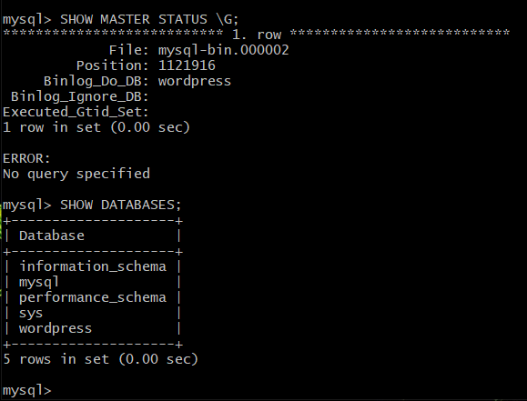
</p>
<p align="left">
  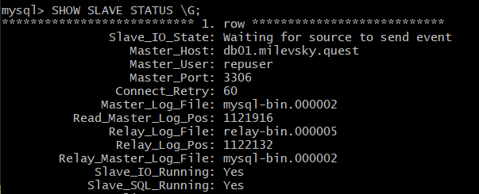
</p>

## 5. Установка WordPress
Необходимо разработать Ansible роль для установки WordPress:  
• Имя сервера: app.you.domain
• Характеристики: 4vCPU, 4 RAM, Internal address.

Ожидаемые результаты:  
- Виртуальная машина на которой установлен WordPress и Nginx/Apache (на ваше усмотрение).  
- В вашей доменной зоне настроена A-запись на внешний адрес reverse proxy:  https://www.you.domain (WordPress)  
На сервере you.domain отредактирован upstream для выше указанного URL и он смотрит на виртуальную машину на которой установлен WordPress.  
В браузере можно открыть URL https://www.you.domain и увидеть главную страницу WordPress.  

Плейбук запускает роли nginx, wordpress, php - [wordpress.yml](https://github.com/vladmilev/diplom/blob/main/ansible/wordpress.yml)
Также сначала создаем инстанс terraform-а - [wordpress.tf](https://github.com/vladmilev/diplom/blob/main/terraform/wordpress.tf)  
Донастраиваем upsteam сервер и запускаем плейбук nginx-server.yml для работы обратного прокси  
Доводим плейбук до рабочего состояния  
Проверяем работу www.milevsky.quest   
В качестве базы данных при первичной настройке сайта - указываем IP сервера mySQL - мастер db01, поднятый плейбуком mysql.yml  
<p align="left">
  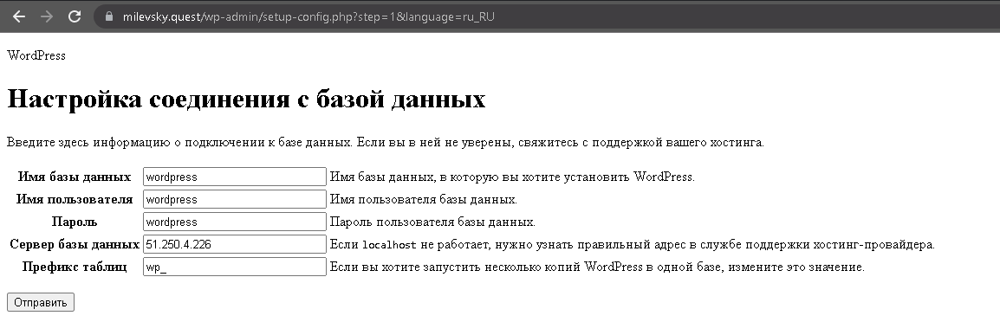
</p>
<p align="left">
  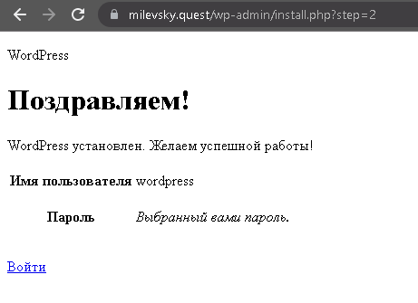
</p>
В результате сайт запустился:
<p align="center">
  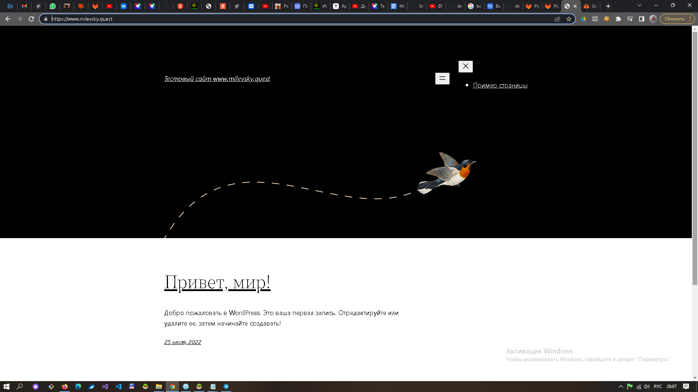
</p>

## 6. Установка Gitlab CE и Gitlab Runner  
Необходимо настроить CI/CD систему для автоматического развертывания приложения при изменении кода.  
• Имена серверов: gitlab.you.domain и runner.you.domain
• Характеристики: 4vCPU, 4 RAM, Internal address.

Цель: построить pipeline доставки кода в среду эксплуатации, то есть настроить автоматический деплой на сервер app.you.domain при коммите в репозиторий с WordPress. Подробнее о [Gitlab CI](https://about.gitlab.com/stages-devops-lifecycle/continuous-integration/)

Ожидаемый результат:
- Интерфейс Gitlab доступен по https. В вашей доменной зоне настроена A-запись на внешний адрес reverse proxy: https://gitlab.you.domain (Gitlab)  
- На сервере you.domain отредактирован upstream для выше указанного URL и он смотрит на виртуальную машину на которой установлен Gitlab  
- При любом коммите в репозиторий с WordPress и создании тега (например, v1.0.0) происходит деплой на виртуальную машину.  

Сначала создаем 2 инстанса terraform-ом - [gitlab.tf](https://github.com/vladmilev/diplom/blob/main/terraform/gitlab.tf) и [runner.tf](https://github.com/vladmilev/diplom/blob/main/terraform/runner.tf)   

Плейбук (gitlab.yml](https://github.com/vladmilev/diplom/blob/main/ansible/gitlab.yml) основывается на одноименной [роли](https://github.com/vladmilev/diplom/tree/main/ansible/roles/gitlab) в которой изменены настройки в файле `defaults\main.yml`  
Доводим плейбук (gitlab.yml](https://github.com/vladmilev/diplom/blob/main/ansible/gitlab.yml) до рабочего состояния.  

Донастраиваем upsteam сервер и запускаем плейбук nginx-server.yml для работы обратного прокси.  
Для входа на странице браузера по адресу gitlab.milevsky.quest используем пароль, полученный командой:  
`sudo gitlab-rake "gitlab:password:reset[root]"` (сброс и назначение нового пароля - root/root22=4)  

Запускаем плейбук Gitlab Runner-a - (runner.yml](https://github.com/vladmilev/diplom/blob/main/ansible/runner.yml)  
Для роли [gitlab-runner](https://github.com/vladmilev/diplom/tree/main/ansible/roles/gitlab-runner) изменяем настройки в файле `defaults\main.yml`
(указываем gitlab_runner_coordinator_url и gitlab_runner_registration_token, которые можно получить на странице Setting \ CI/CD \ Runners \ Expand)  

После запуска runner-а его обнаружит сервер Gitlab:
<p align="center">
  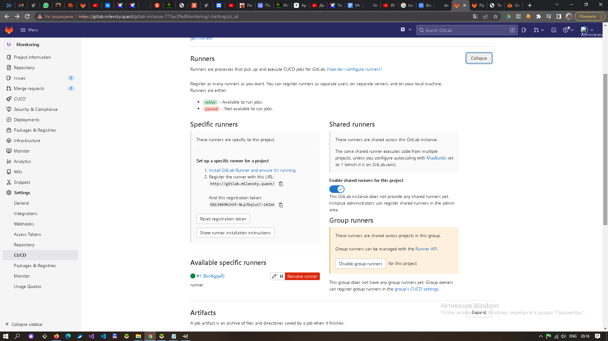
</p>

Pipeline .gitlab-ci.yml был взят из [документации](https://docs.gitlab.com/ee/ci/ssh_keys/):  
```
before_script:
  - eval $(ssh-agent -s)
  - echo "$ssh_key" | tr -d '\r' | ssh-add -
  - mkdir -p ~/.ssh
  - chmod 700 ~/.ssh

stages:         
  - deploy

deploy-job:      
  stage: deploy
  script:
    - echo "Deploying web application..." 
    - ssh -o StrictHostKeyChecking=no ubuntu@app.milevsky.quest sudo chown ubuntu /var/www/wordpress/ -R
    - rsync -vz -e "ssh -o StrictHostKeyChecking=no" ./* ubuntu@app.milevsky.quest:/var/www/wordpress/
    - ssh -o StrictHostKeyChecking=no ubuntu@app.milevsky.quest rm -rf /var/www/wordpress/.git
    - ssh -o StrictHostKeyChecking=no ubuntu@app.milevsky.quest sudo chown www-data /var/www/wordpress/ -R
  only:
      - tags
```
- для связи runner-а с сервером (в секции before_script) устанавливается ssh-соединение - через ssh-agent которому передается переменная ssh_key:
<p align="center">
  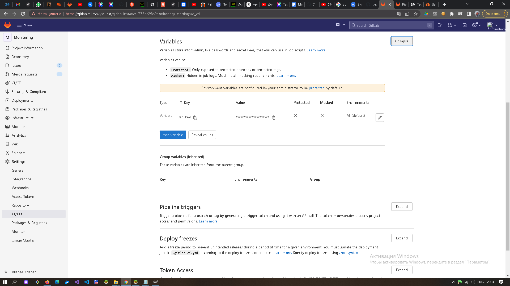
</p>

- чтобы pipline запускался только при коммите тегов прописываем в правилах (rule): 
```
  only:
      - tags
```
При первом входе на сервер, после авторизации, автоматически был создан проект Monitoring, в нем создан репозиторий Monitoring.git  

Теперь задача связать gitlab-проект с исходными файлами нашего приложения - сайта wordpress.milevsky.quest   

Запустим и инициализируем сайт wordpress.milevsky.quest (плейбук wordpress.yml), добавим все исходные файлы сайта (/var/www/wordpress) в этот репозиторий:  
```
git init
git config --global --add safe.directory var/www/wordpress
git add*
git commit -m "first commit"
git remote add origin http://gitlab.milevsky.quest/gitlab-instance-773ac29e/Monitoring.git
git push -u origin --all
```

Убедимся, что pipeline отрабатывает успешно
<p align="center">
  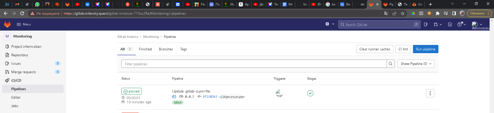
</p>
<p align="center">
  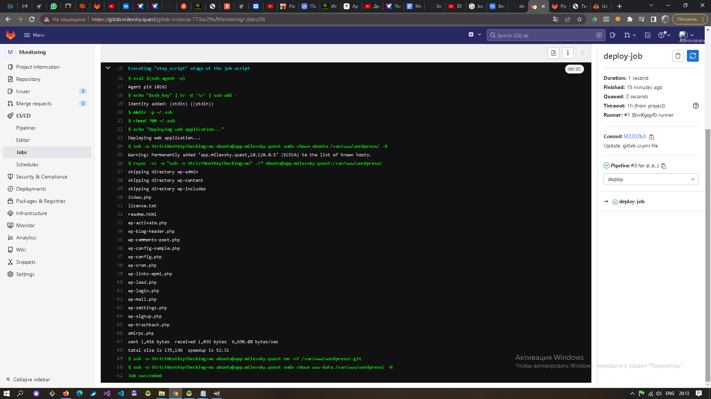
</p>

Теперь, при commit-е нового тега в репозиторий, изменения будут отправляться на сервер c приложением (сайт wordpress.milevsky.quest).


## 7. Установка Prometheus, Alert Manager, Node Exporter и Grafana
Необходимо разработать Ansible роль для установки Prometheus, Alert Manager и Grafana. Имя сервера: monitoring.you.domain (4vCPU, 4 RAM, Internal address).

Цель: получение метрик со всей инфраструктуры.

Результаты:
1. Интерфейсы Prometheus, Alert Manager и Grafana доступены по https.
2. В вашей доменной зоне настроены A-записи на внешний адрес reverse proxy:
• https://grafana.you.domain (Grafana)
• https://prometheus.you.domain (Prometheus)
• https://alertmanager.you.domain (Alert Manager)
3. На сервере you.domain отредактированы upstreams для выше указанных URL и они смотрят на виртуальную машину на которой установлены Prometheus, Alert Manager и Grafana.
4. На всех серверах установлен Node Exporter и его метрики доступны Prometheus.
5. У Alert Manager есть необходимый набор правил для создания алертов.
6.В Grafana есть дашборд отображающий метрики из Node Exporter по всем серверам.

Нашел [описание](https://mcs.mail.ru/docs/additionals/cases/cases-monitoring/case-node-exporter) такой связки:  
Prometheus - центральный сервер, предназначенный для сбора и хранения данных. Сервер Prometheus с заданной периодичностью считывает метрики и помещает полученные данные в Time Series DB (разновидность баз данных, предназначенная для хранения временных рядов - значений с привязкой ко времени).  
Exporters - процессы, обеспечивающие сбор и их передачу серверу Prometheus. Существует много разных exporters, например:  
Node_exporter - сбор системных метрик (процессор, память, и т.д.).  
Mysqld_exporter - сбор метрик работы сервера MySQL.  
После запуска exporter начинает сбор соответствующих метрик и ожидает запросов от сервера Prometheus по заданному порту. Данных передаются в формате http.  
Grafana - удобный frontend для визуализации накопленных данных.  
Prometheus тоже умеет генерировать алерты на основе настраиваемых правил.  
Alertmanager - позволяет сортировать алерты и отправлять сообщения только первый раз (срабатывания правила) [настройка на Ubuntu](https://losst.ru/nastrojka-alertmanager-prometheus).

Запускаем плейбук [exporter.yml](https://github.com/vladmilev/diplom/blob/main/ansible/exporter.yml), он запускает для всех хостов установку Node Exporter с помощью роли [node_exporter](https://github.com/vladmilev/diplom/tree/main/ansible/roles/node_exporter).  

Запускаем плейбук [monitoring.yml](https://github.com/vladmilev/diplom/blob/main/ansible/monitoring.yml), он запускает для хоста monitoring установку Prometheus и Alert Manager с помощью роли [monitoring](https://github.com/vladmilev/diplom/tree/main/ansible/roles/monitoring) и инструмент визуализации Grafana с помощью роли [grafana](https://github.com/vladmilev/diplom/tree/main/ansible/roles/grafana).  

Необхордимы [набор правил](https://awesome-prometheus-alerts.grep.to/rules.html) настраивается в файле [roles/monitoring/templates/alert.yml](https://github.com/vladmilev/diplom/blob/main/ansible/roles/monitoring/templates/alert.yml).  

Сбор метрик Prometheus-ом настраивается в файле [roles\monitoring\templates\prometheus.yml](https://github.com/vladmilev/diplom/blob/main/ansible/roles/monitoring/templates/prometheus.yml).  

