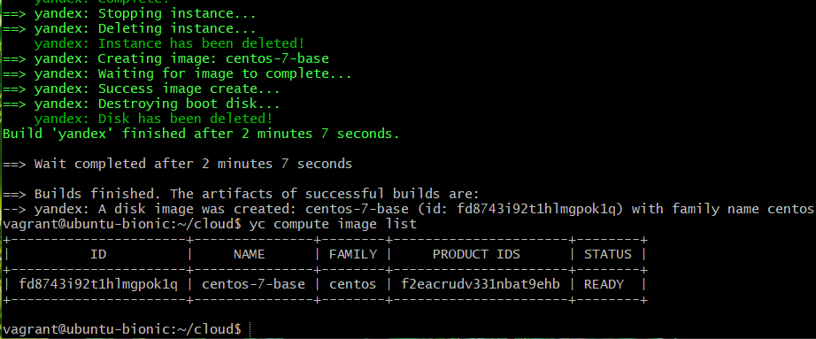

# Домашнее задание к занятию "5.4. Оркестрация группой Docker контейнеров на примере Docker Compose"


## Задача 1
Создать собственный образ операционной системы с помощью Packer.  
Для получения зачета, вам необходимо предоставить: cкриншот страницы, как на слайде из презентации (слайд 37).

Скриншот результата: 
<p align="center">
  
</p>

```
Авторизовался на Яндекс.Облако, создал облако cloud-vladmilev

Установка Packer (https://www.packer.io/downloads)
$ curl -fsSL https://apt.releases.hashicorp.com/gpg | sudo apt-key add -
$ sudo apt-add-repository "deb [arch=amd64] https://apt.releases.hashicorp.com $(lsb_release -cs) main"
$ sudo apt-get update && sudo apt-get install packer
~$ sudo snap install packer
2022-01-31T19:14:11Z INFO Waiting for automatic snapd restart...
packer 1.0.0-2 from Nathan Handler (nhandler) installed
vagrant@ubuntu-bionic:~$ packer --version
1.0.0

Установка Terraform (terraform.io)
$ sudo apt-get update && sudo apt-get install -y gnupg software-properties-common curl
$ curl -fsSL https://apt.releases.hashicorp.com/gpg | sudo apt-key add -
$ sudo apt-add-repository "deb [arch=amd64] https://apt.releases.hashicorp.com $(lsb_release -cs) main"
$ sudo apt-get update && sudo apt-get install terraform
$ $ terraform --version
Terraform v1.1.4
on linux_amd64

Установка утилиты yc (https://cloud.yandex.ru/docs/cli/quickstart)
$ curl https://storage.yandexcloud.net/yandexcloud-yc/install.sh | bash
$ exit
$ vagrant ssh
$ yc --version
Yandex.Cloud CLI 0.87.0 linux/amd64

$ yc init
Welcome! This command will take you through the configuration process.
Please go to https://oauth.yandex.ru/authorize?response_type=token&client_id=1a6990aa636648e9b2ef855fa7bec2fb in order to obtain OAuth token.

Please enter OAuth token: AQAAAAAAj43QAATuwaZxmI3B1ENSot2r1onn1w0
You have one cloud available: 'cloud-vladmilev' (id = b1gcjvo46oid607b3pg8). It is going to be used by default.
Please choose folder to use:
 [1] default (id = b1ggqdglh6qsi4s5off8)
 [2] Create a new folder
Please enter your numeric choice: 2
Please enter a folder name: netology
Your current folder has been set to 'netology' (id = b1g672m7v4q205bdqfc0).
Do you want to configure a default Compute zone? [Y/n] y
Which zone do you want to use as a profile default?
 [1] ru-central1-a
 [2] ru-central1-b
 [3] ru-central1-c
 [4] Don't set default zone
Please enter your numeric choice: 1
Your profile default Compute zone has been set to 'ru-central1-a'.

$ yc config list
token: AQAAAAAAj43QAATuwaZxmI3B1ENSot2r1onn1w0
cloud-id: b1gcjvo46oid607b3pg8
folder-id: b1g672m7v4q205bdqfc0
compute-default-zone: ru-central1-a

# Инициализация сети
$ yc vpc network create --name net
id: enp7nfpn17o2apus96bo
folder_id: b1g672m7v4q205bdqfc0
created_at: "2022-02-01T02:50:04Z"
name: net

# Инициализация подсети
$ yc vpc subnet create --name my-subnet-a --zone ru-central1-a --range 10.1.2.0/24 --network-name net
id: e9bsvjqagjijlprn8ild
folder_id: b1g672m7v4q205bdqfc0
created_at: "2022-02-01T02:52:49Z"
name: my-subnet-a
network_id: enp7nfpn17o2apus96bo
zone_id: ru-central1-a
v4_cidr_blocks:
- 10.1.2.0/24

# Сборка образа в Yandex.Cloud 
$ mkdir cloud
vagrant@ubuntu-bionic:~$ cd cloud
vagrant@ubuntu-bionic:~/cloud$ mkdir packer
vagrant@ubuntu-bionic:~/cloud$ nano centos-7-base.json
-----------------------
{
  "builders": [
    {
      "disk_type": "network-nvme",
      "folder_id": "b1g672m7v4q205bdqfc0",
      "image_description": "by packer",
      "image_family": "centos",
      "image_name": "centos-7-base",
      "source_image_family": "centos-7",
      "ssh_username": "centos",
      "subnet_id": "e9bsvjqagjijlprn8ild",
      "token": "",
      "type": "yandex",
      "use_ipv4_nat": true,
      "zone": "ru-central1-a"
    }
  ],
  "provisioners": [
    {
      "inline": [
        "sudo yum -y update",
        "sudo yum -y install bridge-utils bind-utils iptables curl net-tools tcpdump rsync telnet openssh-server"
      ],
      "type": "shell"
    }
  ]
}
-----------------------
$ /usr/bin/packer --version
1.7.9
vagrant@ubuntu-bionic:~/cloud$ /usr/bin/packer validate centos-7-base.json
The configuration is valid.
vagrant@ubuntu-bionic:~/cloud$ /usr/bin/packer build centos-7-base.json
...
$ yc compute image list
+----------------------+---------------+--------+----------------------+--------+
|          ID          |     NAME      | FAMILY |     PRODUCT IDS      | STATUS |
+----------------------+---------------+--------+----------------------+--------+
| fd8743i92t1hlmgpok1q | centos-7-base | centos | f2eacrudv331nbat9ehb | READY  |
+----------------------+---------------+--------+----------------------+--------+

https://prnt.sc/26mpr9e
```

## Задача 2
Создать вашу первую виртуальную машину в Яндекс.Облаке.  
Для получения зачета, вам необходимо предоставить:  cкриншот страницы свойств созданной ВМ.
```
$ mkdir terraform
$ cd terraform
$ nano network.tf
-------
# Network
resource "yandex_vpc_network" "default" {
  name = "net"
}

resource "yandex_vpc_subnet" "default" {
  name = "subnet"
  zone           = "ru-central1-a"
  network_id     = "${yandex_vpc_network.default.id}"
  v4_cidr_blocks = ["192.168.101.0/24"]
}
---------
$ nano node01.tf
---------
resource "yandex_compute_instance" "node01" {
  name                      = "node01"
  zone                      = "ru-central1-a"
  hostname                  = "node01.netology.cloud"
  allow_stopping_for_update = true

  resources {
    cores  = 8
    memory = 8
  }

  boot_disk {
    initialize_params {
      image_id    = "${var.centos-7-base}"
      name        = "root-node01"
      type        = "network-nvme"
      size        = "50"
    }
  }

  network_interface {
    subnet_id = "${yandex_vpc_subnet.default.id}"
    nat       = true
  }

  metadata = {
    ssh-keys = "centos:${file("~/.ssh/id_rsa.pub")}"
  }
}
--------
$ nano output.tf
-------
output "internal_ip_address_node01_yandex_cloud" {
  value = "${yandex_compute_instance.node01.network_interface.0.ip_address}"
}

output "external_ip_address_node01_yandex_cloud" {
  value = "${yandex_compute_instance.node01.network_interface.0.nat_ip_address}"
}
-------
$ nano provider.tf
-------
# Provider
terraform {
  required_providers {
    yandex = {
      source = "yandex-cloud/yandex"
    }
  }
}

provider "yandex" {
  service_account_key_file = "key.json"
  cloud_id  = "${var.yandex_cloud_id}"
  folder_id = "${var.yandex_folder_id}"
}
-------
$ nano variables.tf
-------
# Заменить на ID своего облака
# https://console.cloud.yandex.ru/cloud?section=overview
variable "yandex_cloud_id" {
  default = "b1gcjvo46oid607b3pg8"
}

# Заменить на Folder своего облака
# https://console.cloud.yandex.ru/cloud?section=overview
variable "yandex_folder_id" {
  default = "b1g672m7v4q205bdqfc0"
}

# Заменить на ID своего образа
# ID можно узнать с помощью команды yc compute image list
variable "centos-7-base" {
  default = "fd8743i92t1hlmgpok1q"
}
-------
$ terraform init
Terraform has been successfully initialized!

* Создание ключа авторизации (key.json) https://cloud.yandex.ru/docs/iam/quickstart-sa
$ yc iam key create --service-account-name cloud-vladmilev --output key.json
ERROR: service account with name "cloud-vladmilev" not found

$ yc iam service-account list
+----+------+
| ID | NAME |
+----+------+
+----+------+

$ yc iam service-account create cloud-vladmilev
id: aje4nme76j5h2qgmq6nj
folder_id: b1g672m7v4q205bdqfc0
created_at: "2022-02-03T03:02:58.428720721Z"
name: cloud-vladmilev

$ yc iam service-account list
+----------------------+-----------------+
|          ID          |      NAME       |
+----------------------+-----------------+
| aje4nme76j5h2qgmq6nj | cloud-vladmilev |
+----------------------+-----------------+

$ yc iam key create --service-account-name cloud-vladmilev --output key.json
id: ajeqjab3pq87mc93loko
service_account_id: aje4nme76j5h2qgmq6nj
created_at: "2022-02-03T03:04:59.736308198Z"
key_algorithm: RSA_2048

$ cp key.json ./terraform/key.json
$ terraform plan
╷
│ Error: Invalid function argument
│
│   on node01.tf line 27, in resource "yandex_compute_instance" "node01":
│   27:     ssh-keys = "centos:${file("~/.ssh/id_rsa.pub")}"

$ ssh-keygen
$ terraform plan
Error: Error while requesting API to create network: server-request-id = 50bdc038-887b-4274-9b6b-64ad13f1dd67 server-trace-id = 17e208646359451a:cedd3d2acdd1ab95:17e208646359451a:1 client-request-id = a238ef62-9a48-4c92-a3f6-5565ee68d5c0 client-trace-id = 3f31a9b7-361b-43e5-b0b3-5cae2f86aa9b rpc error: code = PermissionDenied desc = Permission denied

Надо назначить роль admin для созданного аккаунта - сначала узнать пользовательский id по имени пользователя
$ yc iam user-account get <мое имя пользователя lea..>
id: aje...

vagrant@ubuntu-bionic:~/cloud/terraform$ yc iam service-account add-access-binding cloud-vladmilev --role admin --subject userAccount:aje2...

И это не помогло, надо делат через web https://cloud.yandex.ru/docs/iam/operations/sa/assign-role-for-sa  
зайти в каталог и там выбрать сервисный аккаунт
https://console.cloud.yandex.ru/folders/b1g672m7v4q205bdqfc0?section=service-accounts

Теперь ошибка "Quota limit vpc.networks.count exceeded"

Удалил сеть и подсеть
$ yc vpc subnet delete --name my-subnet-a && yc vpc network delete --name net
done (6s)

Запустил 
$ terraform apply --auto-approve
Apply complete! Resources: 3 added, 0 changed, 0 destroyed.
Outputs:
external_ip_address_node01_yandex_cloud = "51.250.0.172"
internal_ip_address_node01_yandex_cloud = "192.168.101.23"

результат https://prnt.sc/26nom6o

```

## Задача 3
Создать ваш первый готовый к боевой эксплуатации компонент мониторинга, состоящий из стека микросервисов.  
Для получения зачета, вам необходимо предоставить: cкриншот работающего веб-интерфейса Grafana с текущими метриками.
```
vagrant@ubuntu-bionic:~/hw/virt-homeworks/05-virt-04-docker-compose/src$ cd ansible
vagrant@ubuntu-bionic:~/hw/virt-homeworks/05-virt-04-docker-compose/src/ansible$ nano inventory
vagrant@ubuntu-bionic:~/hw/virt-homeworks/05-virt-04-docker-compose/src/ansible$ cat inventory
[nodes:children]
manager

[manager]
node01.netology.cloud ansible_host=51.250.0.172
$ sudo apt install ansible -y
$ ansible-playbook provision.yml
e$ ssh centos@51.250.0.172
[centos@node01 ~]$ sudo -i
[root@node01 ~]# docker ps
CONTAINER ID   IMAGE                                       COMMAND                  CREATED         STATUS                   PORTS                                                                              NAMES
d639c092286e   gcr.io/google-containers/cadvisor:v0.34.0   "/usr/bin/cadvisor -…"   3 minutes ago   Up 2 minutes (healthy)   8080/tcp                                                                           cadvisor
dfc91ff814de   prom/node-exporter:v0.18.1                  "/bin/node_exporter …"   3 minutes ago   Up 2 minutes             9100/tcp                                                                           nodeexporter
b02203b141ba   prom/alertmanager:v0.20.0                   "/bin/alertmanager -…"   3 minutes ago   Up 2 minutes             9093/tcp                                                                           alertmanager
e6e39be47a85   stefanprodan/caddy                          "/sbin/tini -- caddy…"   3 minutes ago   Up 2 minutes             0.0.0.0:3000->3000/tcp, 0.0.0.0:9090-9091->9090-9091/tcp, 0.0.0.0:9093->9093/tcp   caddy
a4fb22c6d9f9   prom/prometheus:v2.17.1                     "/bin/prometheus --c…"   3 minutes ago   Up 2 minutes             9090/tcp                                                                           prometheus
fe42ad4fe779   grafana/grafana:7.4.2                       "/run.sh"                3 minutes ago   Up 2 minutes             3000/tcp                                                                           grafana
5858526d6d21   prom/pushgateway:v1.2.0                     "/bin/pushgateway"       3 minutes ago   Up 2 minutes             9091/tcp                                                                           pushgateway

Открыл в браузере
http://51.250.0.172:3000

Результат: 
https://prnt.sc/26noteu
```

Задача 4 (*)
Создать вторую ВМ и подключить её к мониторингу развёрнутому на первом сервере.  
Для получения зачета, вам необходимо предоставить: cкриншот из Grafana, на котором будут отображаться метрики добавленного вами сервера.
```

```
