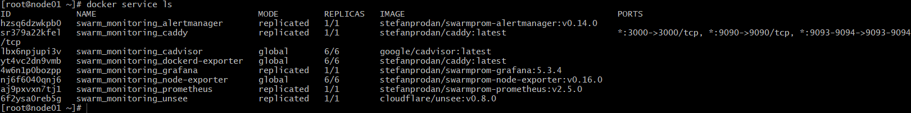

# Домашнее задание к занятию "5.5. Оркестрация кластером Docker контейнеров на примере Docker Swarm"


## Задача 1
Дайте письменые ответы на следующие вопросы:  
- В чём отличие режимов работы сервисов в Docker Swarm кластере: replication и global?  
- Какой алгоритм выбора лидера используется в Docker Swarm кластере?  
- Что такое Overlay Network?  
```

```

## Задача 2
Создать ваш первый Docker Swarm кластер в Яндекс.Облаке  
Для получения зачета, вам необходимо предоставить скриншот из терминала (консоли), с выводом команды:  
docker node ls  

Скриншот результата: 
<p align="center">
  
</p>

```
1. сгенерировал key.json (в папке terraform)
yc iam key create --service-account-name cloud-vladmilev --output key.json
2. $ terraform init
$ terraform validate
$ terraform plan
$ terraform apply
Ошибка
3. Указать свои значения идентификаторов
$ nano variables.tf
4.Удалил сеть и подсеть
$ yc vpc subnet delete --name my-subnet-a && yc vpc network delete --name net
5.Запуск
$ terraform apply --auto-approve
external_ip_address_node01 = "62.84.114.168"
external_ip_address_node02 = "62.84.114.104"
external_ip_address_node03 = "62.84.115.217"
external_ip_address_node04 = "62.84.115.148"
external_ip_address_node05 = "62.84.114.148"
external_ip_address_node06 = "62.84.114.64"
internal_ip_address_node01 = "192.168.101.11"
internal_ip_address_node02 = "192.168.101.12"
internal_ip_address_node03 = "192.168.101.13"
internal_ip_address_node04 = "192.168.101.14"
internal_ip_address_node05 = "192.168.101.15"
internal_ip_address_node06 = "192.168.101.16"

6. Подключение к ноде
vagrant@ubuntu-bionic:~/hw/virt-homeworks/05-virt-05-docker-swarm/src/terraform$ ssh centos@62.84.114.168
[centos@node01 ~]$ sudo -i
[root@node01 ~]# docker node ls
ID                            HOSTNAME             STATUS    AVAILABILITY   MANAGER STATUS   ENGINE VERSION
i58om3p7wiygplkrzfkv3amae *   node01.netology.yc   Ready     Active         Leader           20.10.12
gkr3tlu4reagr9ozodc95e43v     node02.netology.yc   Ready     Active         Reachable        20.10.12
ikit7g93sn9vt39qwvezng0mj     node03.netology.yc   Ready     Active         Reachable        20.10.12
xgsdvhg8dp0drh93orjih6cqd     node04.netology.yc   Ready     Active                          20.10.12
aqxoqgpvl22kut2u9qug7yl4l     node05.netology.yc   Ready     Active                          20.10.12
y1l7zcgbf3wzrq3e6gj6p3es2     node06.netology.yc   Ready     Active                          20.10.12

Скриншот https://prnt.sc/26px32m
```

## Задача 3
Создать ваш первый, готовый к боевой эксплуатации кластер мониторинга, состоящий из стека микросервисов.  
Для получения зачета, вам необходимо предоставить скриншот из терминала (консоли), с выводом команды:  
docker service ls  

Скриншот результата: 
<p align="center">
  
</p>

```
[root@node01 ~]# cat /etc/hosts
127.0.0.1   localhost localhost.localdomain localhost4 localhost4.localdomain4
::1         localhost localhost.localdomain localhost6 localhost6.localdomain6

192.168.101.14 node04.netology.yc
192.168.101.15 node05.netology.yc
192.168.101.16 node06.netology.yc
192.168.101.12 node02.netology.yc
192.168.101.13 node03.netology.yc
192.168.101.11 node01.netology.yc

[root@node01 ~]# docker stack ls
NAME               SERVICES   ORCHESTRATOR
swarm_monitoring   8          Swarm

[root@node01 ~]# docker stack ps swarm_monitoring
....
[root@node01 ~]# docker service ls
ID             NAME                                MODE         REPLICAS   IMAGE                                          PORTS
hzsq6dzwkpb0   swarm_monitoring_alertmanager       replicated   1/1        stefanprodan/swarmprom-alertmanager:v0.14.0
sr379a22kfel   swarm_monitoring_caddy              replicated   1/1        stefanprodan/caddy:latest                      *:3000->3000/tcp, *:9090->9090/tcp, *:9093-9094->9093-9094/tcp
lbx6npjupi3v   swarm_monitoring_cadvisor           global       6/6        google/cadvisor:latest
yt4vc2dn9vmb   swarm_monitoring_dockerd-exporter   global       6/6        stefanprodan/caddy:latest
4w6n1p0bozpp   swarm_monitoring_grafana            replicated   1/1        stefanprodan/swarmprom-grafana:5.3.4
nj6f6040qnj6   swarm_monitoring_node-exporter      global       6/6        stefanprodan/swarmprom-node-exporter:v0.16.0
aj9pxvxn7tj1   swarm_monitoring_prometheus         replicated   1/1        stefanprodan/swarmprom-prometheus:v2.5.0
6f2ysa0reb5g   swarm_monitoring_unsee              replicated   1/1        cloudflare/unsee:v0.8.0

https://prnt.sc/26px5n9
```
