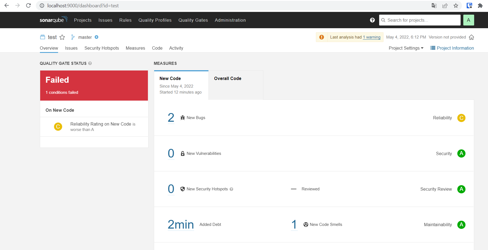
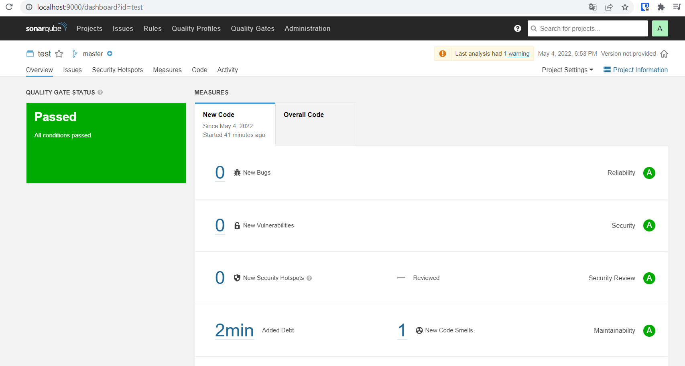

# Домашнее задание к занятию "09.02 CI\CD"

## Знакомоство с SonarQube

Подготовка к выполнению:  
1. Выполняем docker pull sonarqube:8.7-community
2. Выполняем docker run -d --name sonarqube -e SONAR_ES_BOOTSTRAP_CHECKS_DISABLE=true -p 9000:9000 sonarqube:8.7-community
3. Ждём запуск, смотрим логи через docker logs -f sonarqube
4. Проверяем готовность сервиса через браузер (http://localhost:9000/)
5. Заходим под admin\admin, меняем пароль на свой
В целом, в этой статье (https://docs.sonarqube.org/latest/setup/install-server/) описаны все варианты установки,  
включая и docker, но так как нам он нужен разово, то достаточно того набора действий, который я указал выше.

Основная часть  
- Создаём новый проект, название произвольное
- Скачиваем пакет sonar-scanner, который нам предлагает скачать сам sonarqube
- Делаем так, чтобы binary был доступен через вызов в shell (или меняем переменную PATH или любой другой удобный вам способ)
- Проверяем sonar-scanner --version
- Запускаем анализатор против кода из директории example с дополнительным ключом -Dsonar.coverage.exclusions=fail.py
- Смотрим результат в интерфейсе
- Исправляем ошибки, которые он выявил(включая warnings)
- Запускаем анализатор повторно - проверяем, что QG пройдены успешно
- Делаем скриншот успешного прохождения анализа, прикладываем к решению ДЗ

Скриншот запуска с ошибкой (https://prnt.sc/H9Gss4WU1Vpk)  
<p align="center">
  
</p>

Скриншот запуска после исправлений (https://prnt.sc/nRbGLFiFZCj7)  
<p align="center">
  
</p>

Подробности
```
SonarQube - статический анализатор кода
1) перебросил порт 9000 для Vagrant c целью доступа по http://localhost:9000/
 Vagrant.configure("2") do |config|
 	config.vm.box = "ubuntu/bionic64"
        config.vm.network "forwarded_port", guest:9000, host:9000
 end
2) в логах
sudo -s
docker logs -f sonarqube
выдает ошибку "Native memory allocation (mmap) failed to map 65536 bytes for committing reserved memory"оперативной 
- увеличение оперативной памяти виртуальной машины в два раза результата не дало
- поиск решения навел на https://github.com/SonarSource/docker-sonarqube/issues/185 помогло (ES_JAVA_OPTS="-Xms1g -Xmx1g")
docker rm sonarqube
docker run -d --name sonarqube -e ES_JAVA_OPTS="-Xms1g -Xmx1g" -p 9000:9000 sonarqube:8.7-community
Создал проект test
Скачал windows-архив по ссылке https://docs.sonarqube.org/latest/analysis/scan/sonarscanner/
Установил в корень C:\sonar, указал путь в PATH C:\sonar\bin, файл fail.py создал в директории C:\sonar\project
В conf\sonar-scanner.properties добавил строчку: sonar.host.url=http://localhost:9000
Запуск
sonar-scanner.bat -D"sonar.projectKey=test" -D"sonar.login=4c08914fe12e95361896417106ffe88877ecedb7" -Dsonar.coverage.exclusions=fail.py
Простые сценарии использования Sonarqube https://habr.com/ru/post/652607/
```

## Знакомство с Nexus
Подготовка к выполнению:
1. Выполняем docker pull sonatype/nexus3
2. Выполняем docker run -d -p 8081:8081 --name nexus sonatype/nexus3
3. Ждём запуск, смотрим логи через docker logs -f nexus
4. ПроверяемC:\sonar\project готовность сервиса через бразуер (http://localhost:8081/)
5. Узнаём пароль от admin через docker exec -it nexus /bin/bash
6. Подключаемся под админом, меняем пароль, сохраняем анонимный доступ

Основная часть  
- В репозиторий maven-public загружаем артефакт с GAV параметрами:
```
groupId: netology
artifactId: java
version: 8_282
classifier: distrib
type: tar.gz
```
- В него же загружаем такой же артефакт, но с version: 8_102
- Проверяем, что все файлы загрузились успешно 
- В ответе присылаем файл maven-metadata.xml для этого артефекта

Скриншот проверки, что файлы загружены (https://prnt.sc/6ZTnTE0g4LUP)  
<p align="center">
  
</p>  

Ответ: [Скачать файл maven-metadata.xml](https://github.com/vladmilev/devops-netology/blob/main/maven-metadata.xml)  

Подробности  
```
Nexus Sonatype - менеджер репозиториев для локального хранения и управления артефактами, зависимостями и Docker-образами.  
- vagrant перебросил для браузера порт 8081
- удалил старый контейнер и образ - docker stop, rm, rmi
- получил ошибку в логах (docker logs -f nexus):
OpenJDK 64-Bit Server VM warning: INFO: os::commit_memory(0x0000000717000000, 1890582528, 0) failed; error='Cannot allocate memory' (errno=12)
- помогло увеличение памяти в virtualbox (в настройках) до 5125 Мб
- пароль админа cd /nexus-data; cat admin.passwrd
- Sign сменил пароль на 123, Enable anonymous access
- добавление артифактов - через maven-releases
```

## Знакомство с Maven
Подготовка к выполнению:  
1. Скачиваем дистрибутив с maven (https://maven.apache.org/download.cgi)
2. Разархивируем, делаем так, чтобы binary был доступен через вызов в shell (или меняем переменную PATH или любой другой удобный вам способ)
3. Проверяем mvn --version
4. Забираем директорию mvn с pom

Основная часть  
- Меняем в pom.xml блок с зависимостями под наш артефакт из первого пункта задания для Nexus (java с версией 8_282)
- Запускаем команду mvn package в директории с pom.xml, ожидаем успешного окончания
- Проверяем директорию ~/.m2/repository/, находим наш артефакт
- В ответе присылаем исправленный файл pom.xml

Скриншот создания jar файла проекта (https://prnt.sc/-p-nRkGp8Lgh)  
<p align="center">
  
</p>  

Ответ: [Скачать файл pom.xml](https://github.com/vladmilev/devops-netology/blob/main/pom.xml)  

Подробности  
```
Apache Maven — фреймворк для автоматизации сборки проектов на основе описания их структуры в файлах на языке POM, являющемся подмножеством XML.
Устанавливал в Windows по https://www.examclouds.com/ru/java/java-core-russian/install-maven
mvn package возвращает ошибку если sonatype/nexus3 не запущен в докер контейнере виртуальной машины
Проверять следует поддиректорию target
```
